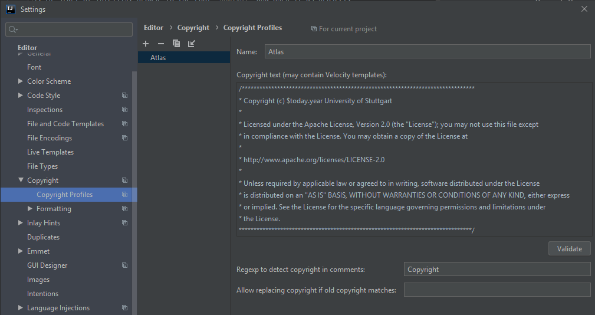
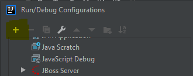

# IntelliJ Setup

1. At start of IntelliJ, browse to the root `pom.xml` and open it as project.
2. Enable checkstyle:
  - Install the [IntelliJ Checkstyle Plugin](https://plugins.jetbrains.com/plugin/1065-checkstyle-idea).
    It can be found via plug-in repository (File -> Settings -> Plugins -> Browse repositories)
    
  - Open the Settings (by pressing <kbd>Ctrl</kbd> + <kbd>Alt</kbd> + <kbd>S</kbd>)
  - Go to Other Settings -> CheckStyle.
  - Click on the plus and add `checkstyle.xml`. It is located in `docs/dev/config/IntelliJ IDEA`.
  
    
3. Configure the code style (Source: <https://youtrack.jetbrains.com/issue/IDEA-61520#comment=27-1292600>)
    1. Open the Settings (by pressing <kbd>Ctrl</kbd> + <kbd>Alt</kbd> + <kbd>S</kbd>)
    3. Go to "Editor > Code Style"
    3. Click "Manage..." (right of "Scheme:")
    4. Click "Import Scheme"
    4. Choose "IntelliJ IDEA code style XML"
    5. Navigate to `intellij-idea-code-style.xml`. It is located in `docs/dev/config/IntelliJ IDEA`.
    6. Click "OK"
    7. Click "Apply"
    8. Click "Close"
4. Setup code headers to be inserted automatically
    
    1. Open the Settings (by pressing <kbd>Ctrl</kbd> + <kbd>Alt</kbd> + <kbd>S</kbd>)
    2. Go to Editor > Copyright  > Copyright Profiles
    3. Click the plus
    4. Name "Atlas"
    5. Copyright text from [CodeHeaders](CodeHeaders.md)
	6. Click "Apply"
    7. Go to Editor > Copyright > Formatting
    8. Adjust copyright formatting settings
        
       - Change to `Use block comments` with `Prefix each line`
       - Set `Relative Location` to `Before other comments`
       - Increase `Separator before/after Length` to `81`
    9. Go to Editor > Copyright
    10. Set "Atlas" as Default project copyright
    11. Click "Apply"
5. Setup Apache Tomcat
    1. Download Tomcat 9.0 from https://tomcat.apache.org/download-90.cgi. Choose "zip" (E.g., http://mirror.synyx.de/apache/tomcat/tomcat-9/v9.0.7/bin/apache-tomcat-9.0.7.zip).
    2. Extract it to C:\Apache. Result: C:\Apache\apache-tomcat-9.0.7.
    3. Click Edit Configuration
    
    
    4. Click Tomcat Server -> Local
    
    
    5. Configure Tomcat Path:

    
    
    6. Choose C:\Apache\apache-tomcat-9.0.7 (or wherever you saved and extracted Tomcat) as Tomcat Home and Tomcat base directory. 
    -> Your Tomcat version is displayed, confirm with OK. 
    7. Set no Browser Launch 
    
    
    
    8. Add deployment artifacts: 
    

    
    
    
    
    9. Confirm with Apply
    
    10. Add new run config: 
    
     
     
     
     
     Confirm with Apply and OK